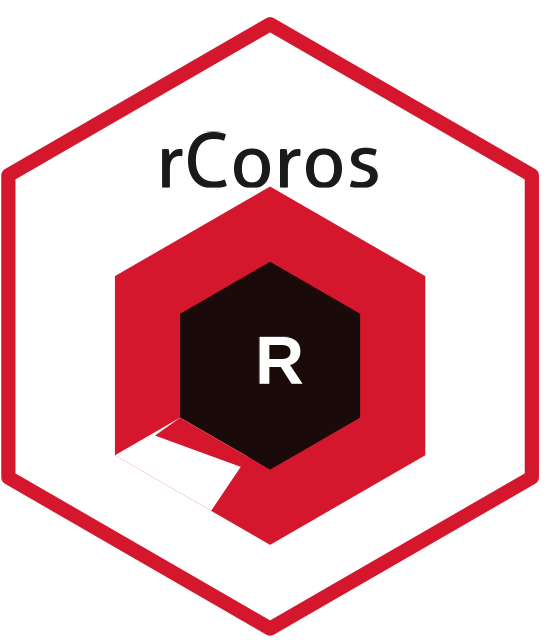

<!-- README.md is generated from README.Rmd. Please edit that file. -->

# rCoros 

<!-- badges: start -->

[](https://github.com/mattyoreilly/rCoros/actions/workflows/R-CMD-check.yaml)
[](https://lifecycle.r-lib.org/articles/stages.html#experimental)
<!-- badges: end -->

rCoros provides a tidy interface to the [COROS Training
Hub](https://coros.com/traininghub) API. Authenticate once, then pull
activities, daily wellness metrics, HRV, workout programmes, and
training calendars — all as tibbles ready for dplyr and ggplot2.

## Installation

Install the development version from GitHub:

``` r
# install.packages("pak")
pak::pak("mattyoreilly/rCoros")
```

## Setup

Add your credentials to `~/.Renviron` so they are never in your scripts.
The easiest way to open that file is:

``` r
usethis::edit_r_environ()
```

Add these two lines, save, and restart R:

    COROS_EMAIL=you@example.com
    COROS_PASSWORD=secret

## Usage

``` r
library(rCoros)
library(dplyr)
library(ggplot2)

# Authenticate (reads COROS_EMAIL / COROS_PASSWORD from env)
auth <- coros_login()

# Activities from the last 30 days — all pages fetched automatically
acts <- coros_activities(auth)

# Running and trail running only
runs <- acts |> filter(sport_type %in% c(100L, 102L))

# Lap splits and HR zones for the most recent run
detail <- coros_activity_detail(
  auth,
  activity_id = runs$activity_id[[1]],
  sport_type  = runs$sport_type[[1]]
)
detail$laps
detail$hr_zones

# 28-day wellness metrics: HRV, RHR, VO2max, training load
metrics <- coros_daily_metrics(auth)

# HRV vs. baseline
ggplot(metrics, aes(date)) +
  geom_ribbon(aes(ymin = hrv_baseline - 5, ymax = hrv_baseline + 5),
              fill = "steelblue", alpha = 0.2) +
  geom_line(aes(y = hrv_baseline), colour = "steelblue") +
  geom_point(aes(y = hrv)) +
  labs(x = NULL, y = "HRV (ms)")

# Upcoming training schedule
coros_schedule(auth)
```

## Functions

| Function | Description |
|----|----|
| `coros_login()` | Authenticate; returns a reusable `coros_auth` object |
| `coros_activities()` | List activities with auto-pagination |
| `coros_activity_detail()` | Lap splits, HR zones, and full summary for one activity |
| `coros_daily_metrics()` | Per-day HRV, RHR, VO2max, training load, stamina |
| `coros_hrv()` | Recent overnight HRV readings (quick dashboard endpoint) |
| `coros_workouts()` | Structured workout library |
| `coros_schedule()` | Planned training calendar |

## API regions

COROS operates separate endpoints for US and EU accounts. If your
account was created in Europe, pass `region = "eu"` to `coros_login()`.

## Learn more

See `vignette("rCoros")` for a full walkthrough including plots,
training-load analysis, and joining activities to wellness data.
